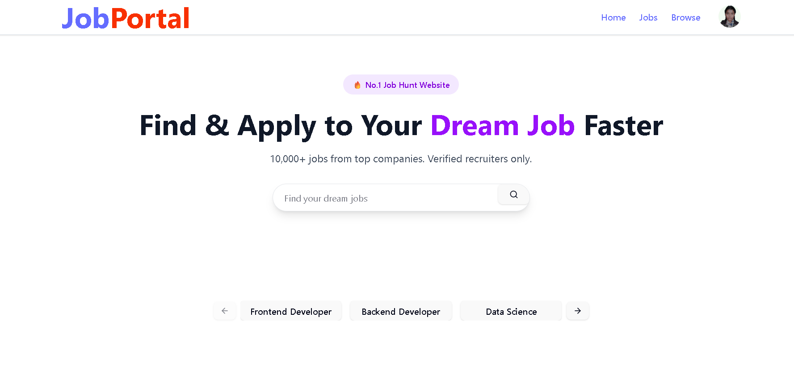
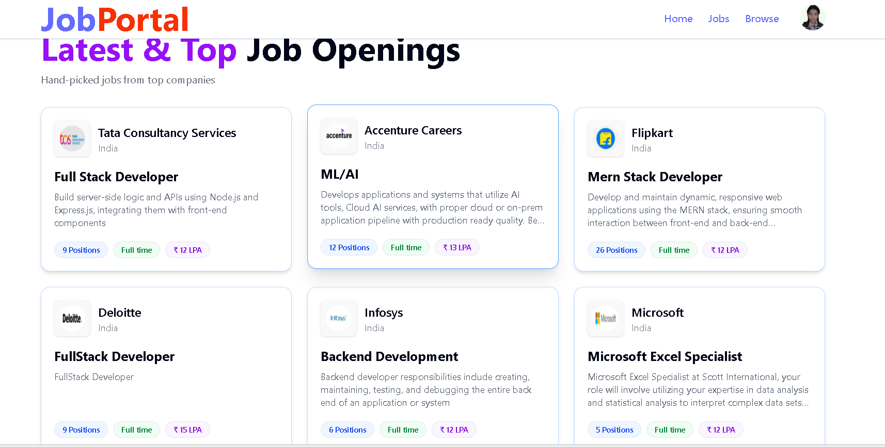
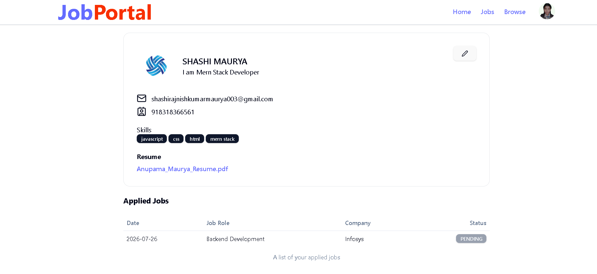
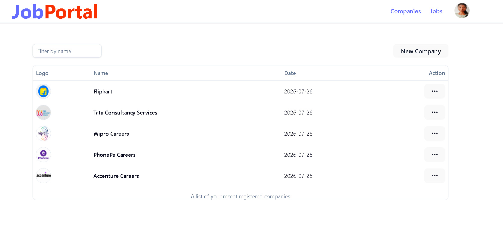
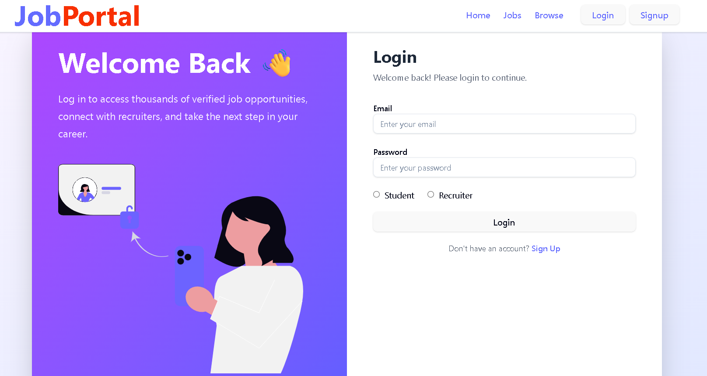
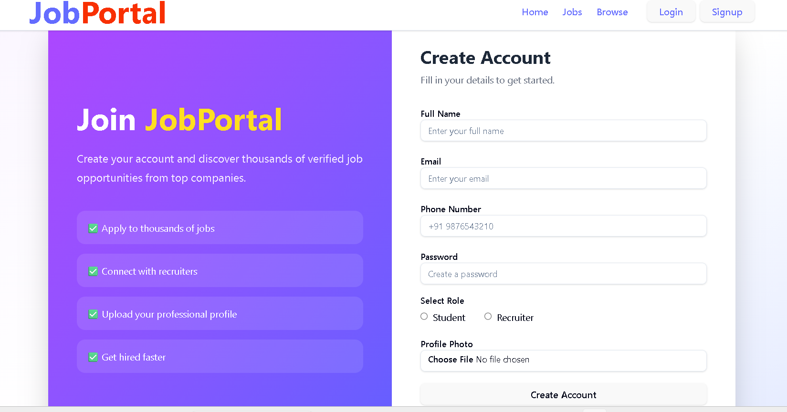

# 💼 Job Portal

A modern Full Stack Job Portal web application that connects students with recruiters. Recruiters can create companies, post job openings, and manage applicants, while students can browse jobs, upload resumes, and apply online.

---

## 🚀 Live Demo

- 🌐 Frontend: https://job-portal-lake-nu.vercel.app/
- 🔗 Backend API: https://job-portal-da8f.onrender.com

---

## 📸 Application Preview

<h2>Application Preview</h2>

<p align="center">
  
  
</p>

<p align="center">
  
  
</p>

---

## 📸 Screenshots

### 🏠 Home Page


### 👤 Login Page


### 👤 Signup Page


### 💼 Job Listings


### 👤 Student Profile


### 🏢 Recruiter Dashboard
)

---

## ✨ Features

### 👨‍🎓 Student

- User Registration & Login
- Secure JWT Authentication
- Browse Available Jobs
- Search & Filter Jobs
- Apply for Jobs
- Upload Resume (PDF)
- Update Profile
- View Applied Jobs
- Responsive Design

### 🏢 Recruiter

- Recruiter Registration/Login
- Company Management
- Create Companies
- Update Company Details
- Post New Jobs
- Manage Posted Jobs
- View Applicants
- Accept/Reject Applications

---

## 🛠️ Tech Stack

### Frontend

- React.js
- Vite
- Tailwind CSS
- Redux Toolkit
- React Router DOM
- Axios
- Shadcn UI
- Lucide React
- Sonner Toast

### Backend

- Node.js
- Express.js
- MongoDB
- Mongoose
- JWT Authentication
- Multer
- Cloudinary
- Bcrypt.js
- Cookie Parser

### Database

- MongoDB Atlas

### Cloud Storage

- Cloudinary

---

## 📂 Project Structure

```
Job Portal
│
├── Backend
│   ├── controllers
│   ├── middleware
│   ├── models
│   ├── routes
│   ├── utils
│   ├── server.js
│   └── package.json
│
├── Frontend
│   ├── src
│   ├── public
│   ├── components
│   ├── redux
│   ├── hooks
│   ├── utils
│   └── package.json
├── screenshots
│   ├── home.png
│   ├── jobs.png
│   ├── profile.png
│   └── recruiter-dashboard.png
│
├── README.md
└── .gitignore
```

---

## Environment Variables

Create a `.env` file inside the Backend folder.

```env
PORT=8000

MONGO_URI=your_mongodb_uri

SECRET_KEY=your_secret_key

CLOUD_NAME=your_cloudinary_cloud_name
API_KEY=your_cloudinary_api_key
API_SECRET=your_cloudinary_api_secret
```

---

## ⚙️ Installation

### Clone Repository

```bash
git clone https://github.com/dollyanu/job-portal.git
```

### Backend Setup

```bash
cd Backend
npm install
npm run dev
```

### Frontend Setup

```bash
cd Frontend
npm install
npm run dev
```

---

## 📌 Future Improvements

- Email Notifications
- Saved Jobs
- Company Reviews
- Job Recommendations
- Admin Dashboard
- Interview Scheduling
- Dark Mode
- Resume Preview
- Real-time Notifications

---

## 📖 Learning Outcomes

This project helped strengthen my understanding of:

- Full Stack MERN Development
- REST API Development
- Authentication & Authorization
- Redux State Management
- MongoDB Database Design
- Cloudinary File Uploads
- Responsive UI Design
- Deployment

---

## 🤝 Contributing

Contributions are welcome!

1. Fork the repository
2. Create a feature branch

```bash
git checkout -b feature-name
```

3. Commit your changes

```bash
git commit -m "Added new feature"
```

4. Push the branch

```bash
git push origin feature-name
```

5. Open a Pull Request

---

## 👩‍💻 Author

**Anupama Maurya**

- 💼 Full Stack Developer
- 🎓 B.Tech Computer Science Engineering Student
- 🌱 Passionate about MERN Stack Development & Open Source

---

⭐ If you like this project, don't forget to star the repository!
